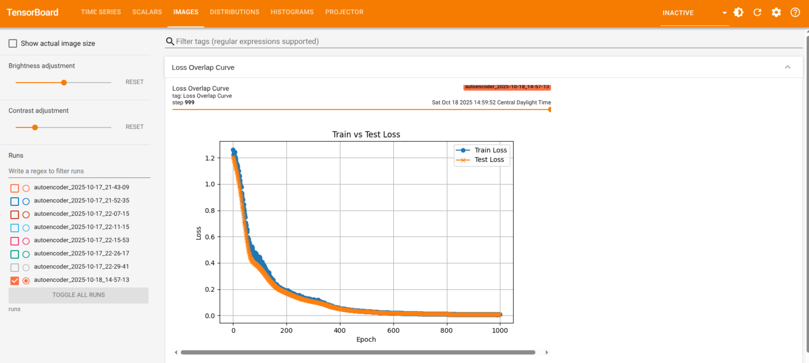

## Train an Autoencoder 

This example demonstrates how to train an autoencoder to reconstruct embedding vectors that represent samples in the Titanic dataset. The raw dataset is encoded, and then split to training and testing partitions. The audoencoder is trained to reconstruct the encoded dataset.

### Launch traning job
To launch the training job for the first time, ensure python virtual environment is activated. For example, 

```
 . ~/recmd_venv/bin/activate
```

Then check `config.yaml` and set the following:

```
resume_training_from_checkpoint: False
```
If everything else looks reasonable, save the config.yaml.

 Then run the following command:

```
python launch-training.py
```

Then in the terminal, the training job progress will appear:

```
Epoch 999 | Train Loss: 0.0064 | Test Loss: 0.0064 | LR: 0.000500 | Time: 0.11 sec
New best model found at epoch 999, saving checkpoint...
Epoch 1000 | Train Loss: 0.0064 | Test Loss: 0.0064 | LR: 0.000500 | Time: 0.12 sec
New best model found at epoch 1000, saving checkpoint...
```

### Resume training from checkpoint
If you want to use any previous checkpoint as the starting point for training, then use `config.yaml` to specify the checkpoint directory and set

```
resume_training_from_checkpoint: True
```
Next, update the checkpoint path to point to the most recent checkpoint

### Observe training progress and results with TensorBoard
To use tensorboard to see the training result, use another terminal to launch TensorBoard with the following command:

```
tensorboard --logdir=runs
```

and this command will indicate the local URL to visualize TensorBoard:

```
TensorBoard 2.20.0 at http://localhost:6006/ (Press CTRL+C to quit)
```

### Train and Test Losses
In `TrainLoop.py`, train and test losses are created as an overlay plot by this line:

```
writer.add_figure("Loss Overlap Curve", plot_loss_curve(train_losses, test_losses), global_step=epoch)
```

This plot will appear under **IMAGES** tab in TensorBoard:



The figure shows how train and test losses improve through training epochs.

### Learning Rate Scheduler
Learning rate is set in `config.yaml` by `learning_rate` under `training`. As training progresses, the learning rate will be adjusted. In `TrainingLoop.py`, there is a scheduler that is set:

```
scheduler = torch.optim.lr_scheduler.ReduceLROnPlateau(optimizer, mode='min', patience=5, factor=0.5)
```

These are the arguments that determine how the scheduler works:
* **Monitors** : Test loss (mode='min' means it watches for decreasing loss)
* **Patience**: Waits 5 epochs without improvement
* **Reduction**: Cuts learning rate in half (factor=0.5)

Basically, this change in learning rate is applied after each epoch with scheduler.step(avg_test_loss)

Learning rate is also captured in TensorBoard. Go to **SCALARS** tab, find **LR** in the metrics list and you will see step-wise values of the learning rate.

## Setup
1. Clone the repository: `git clone <repo-url>`
2. For training/TensorBoard files: `git lfs pull`
3. For specific models only: `git lfs pull --include="*.pt"`

## Clone this repo
When a user do a `git clone ` to this repo, user will get the following:

```
Embedding-AutoEncoder/
├── runs/                    ← Directory EXISTS
│   └── autoencoder_*/       ← Subdirectories EXIST
│       └── events.out.*     ← Files EXIST (but as small pointers)
└── checkpoints_*/           ← Directory EXISTS
    └── *.pt                 ← Files EXIST (but as small pointers)
```

With LFS, files exist but contain only small pointer text.

### Pointer file
As an example, when you clone the repo and look at a checkpoint file:

```
$ cat checkpoints_2025-10-17_21-43-09/autoencoder_epoch1.pt
version https://git-lfs.github.com/spec/v1
oid sha256:4d7a214614ab2935c...
size 1048576
```

This is just a pointer to the actual large file stored in LFS.

### Getting actual large files:

You need to run:

```
git lfs pull                    # Downloads ALL LFS files
# OR
git lfs pull --include="*.pt"   # Downloads only PyTorch files
# OR  
git lfs pull --include="runs/**" # Downloads only TensorBoard files
```
Then you will see either `runs/` or `checkpoints/` directories with all the large files after you do `git lfs pull`.